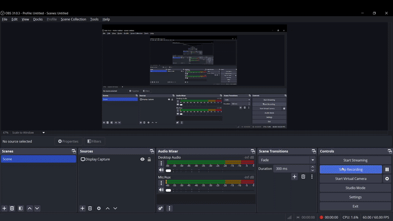

# 🌟 Top Courses


A **React-based web app** that fetches and displays educational courses from the CodeHelp API. Features include category filtering, interactive course cards with like/unlike functionality, and a responsive UI styled with Tailwind CSS. Built with Vite and deployed on Netlify.

---

## 📋 Overview

Top Courses is a responsive web app designed to help users explore educational courses across various categories. It features a clean UI with a fixed navbar, filterable categories, and interactive course cards. The app fetches data dynamically from the CodeHelp API, includes a loading spinner for better UX, and provides toast notifications for user actions.

🚀 **Live Demo**: [Explore Top Courses on Netlify](https://top-courses.netlify.app)

---

## ✨ Features

- 🗂️ **Dynamic Course Fetching**: Fetches course data from the CodeHelp API and displays it in a grid layout.
- 🖥️ **Category Filtering**: Filter courses by categories like All, Development, Business, Design, and Lifestyle with a single click.
- 💡 **Interactive Course Cards**: Each card includes:
  - A course image, title, and description with a "read more/show less" toggle.
  - A like/unlike button with toast notifications for user feedback.
- ⏳ **Loading State**: Displays a spinner during data fetching to enhance user experience.
- 📱 **Responsive Design**: Fixed navbar and filter bar, with a grid layout that adapts seamlessly to different screen sizes using Tailwind CSS.

---

## 🛠️ Tech Stack

| **Technology**      | **Purpose**                     |
|---------------------|---------------------------------|
|  | Building the user interface with component-based architecture |
|  | Utility-first CSS framework for styling |
|  | Application logic and API integration |
|  | Build tool for faster development and smaller bundle sizes |
|  | Toast notifications for user actions (template adapted from online resources) |
|  | Like/unlike icons in course cards |

---

## 🖼️ Screenshots

### Demo GIF
  
*To be added after deployment.*  


---

## 🚀 Future Enhancements

🔮 While the app is currently optimized for desktop users, I’m exploring ways to enhance the mobile experience in the future, ensuring accessibility and a seamless user experience across all devices.

---

## 📦 Getting Started

### Installation

<details>
<summary>📥 Click to view installation steps</summary>

1. **Clone the repository**:
   ```bash
   git clone https://github.com/root-kush369/Top-Courses.git
   ```

2. **Navigate to the project directory**:
   ```bash
   cd Top-Courses
   ```

3. **Install dependencies**:
   ```bash
   npm install
   ```

4. **Start the development server**:
   ```bash
   npm run dev
   ```

5. **Open the app**:
   Visit `http://localhost:5173` (or the port specified by Vite) in your browser to view the app.

</details>

### Deployment on Netlify

1. Push your code to a GitHub repository:
   ```bash
   git add .
   git commit -m "Deploy Top Courses React app"
   git push origin main
   ```

2. Log in to Netlify and click "New site from Git."
3. Connect your GitHub repository and configure the build settings:
   - **Build command**: `npm run build`
   - **Publish directory**: `dist`
4. Deploy the site. Netlify will provide a live URL (e.g., `https://top-courses.netlify.app`).

---

## 🙌 Credits

- The **spinner component** and **toast notification setup** were adapted from online templates to enhance the user experience, while the core functionality, API integration, filtering logic, and UI design were implemented manually.
- Course data is sourced from the [CodeHelp API](https://codehelp-apis.vercel.app/api/get-top-courses).

---

## 📬 Contact

Feel free to reach out for collaboration or feedback:  
📧 **Email**: 5kushbhardwaj7@gmail.com  
🔗 **LinkedIn**: [Kush Sharma](https://linkedin.com/in/kush-bhardwaj7)  
💻 **GitHub**: [root-kush369](https://github.com/root-kush369)

---

*Built with 💻 and ☕ by Kush Sharma*
